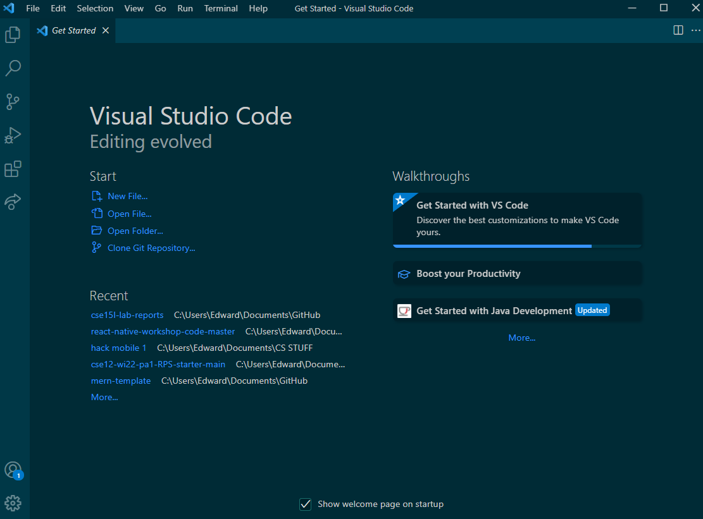
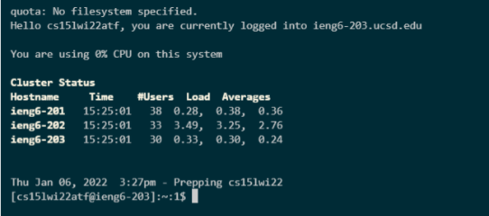
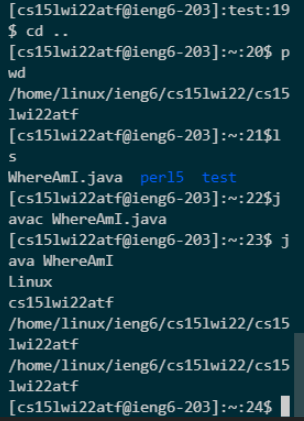
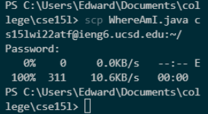
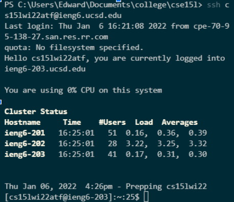
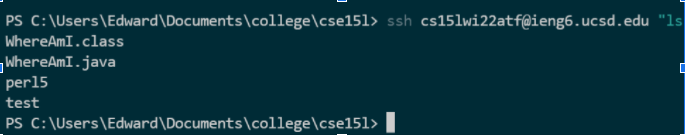

# How To Use ieng6

## 1. Installing VS Code

- First, go to [here](https://code.visualstudio.com/) and download the VS Code installer, you can code here and make the process easier.
- Run the installer, and open the app, it should look like this.



## 2. Remotely Connecting

- Next, go to [here](https://docs.microsoft.com/en-us/windows-server/administration/openssh/openssh_install_firstuse) and follow the instructions to install OpenSSH, which will allow you to remotely connect.
- Next, go to [account lookup](https://sdacs.ucsd.edu/~icc/index.php), to find the account credentials that will allow you to remotely connect to the UCSD computers.
- Then, open the terminal in VS Code(top left on context bar), and type in `$ ssh cs15lwi22YOURLETTERS@ieng6.ucsd.edu`. Replace YOURLETTERS with the letters in your account, enter your password(it will be invisible), and press yes, and then you will be logged in. You should see something like this when you log in.



## 3. Trying Some Commands

- Now that you are logged in, you can try commands.

- Some useful ones include cd, ls, pwd, mkdir, and cp.

- These change directory, list files, print your current file path, make a new directory, and copy files specifically. You can find a cheat sheet [here](https://www.howtogeek.com/412055/37-important-linux-commands-you-should-know/). Some examples are in this screenshot(sorry i had small windows)

- Note that you can also run java files on the remote system with java and javac commands.



## 4. Moving files with scp

- You can copy a file from your local computer to the remote computer using the scp(not secure contain protect) command.

- This command should always be run from your local terminal, not the remote one.

- If you were to create a file on your local system, then run this command while in the same directory, `scp FILENAME cs15lwi22YOURLETTERS@ieng6.ucsd.edu:~/` , then run `ls` after you log in again, you will see your file.

- It should look like this when you scp.



## 5. Setting an SSH Key

- Every time you log in or scp, you'll have to enter your password, unless you do this.

- You can cretae an ssh key so that your local device is recognized when you connect to this server, when you store the public key on the server and the private key on your client.

- Run the following code
  `$ ssh-keygen`
- And then mash enter.

- If on Windows, follow [these](https://docs.microsoft.com/en-us/windows-server/administration/openssh/openssh_keymanagement#user-key-generation) extra steps.

- Now run the following commands:

```
$ ssh cs15lwi22YOURLETTERS@ieng6.ucsd.edu
# enter your password
$ mkdir .ssh
# log out using control c or control d
$ scp /Users/YOUR USERNAME/.ssh/id_rsa.pub cs15lwi22YOURLETTERS@ieng6.ucsd.edu:~/.ssh/authorized_keys
```

- You can now ssh and scp without password, and it should look like this. Note how there is no password prompt.



## 6. Optimizing Remote Running

- You can write a command(or set of commands separated by ;) in quotes after an ssh command to directly run these commands on the remote server, and then log out.

- For example, this command would login, and then print the working directory, and then the list of files in that directory, and then log out.

` $ ssh cs15lwi22yourletters@ieng6.ucsd.edu "pwd; ls"`

- This is what it would look like in practice. Note how I am logged out after the command is run.
  
