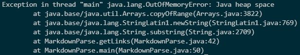
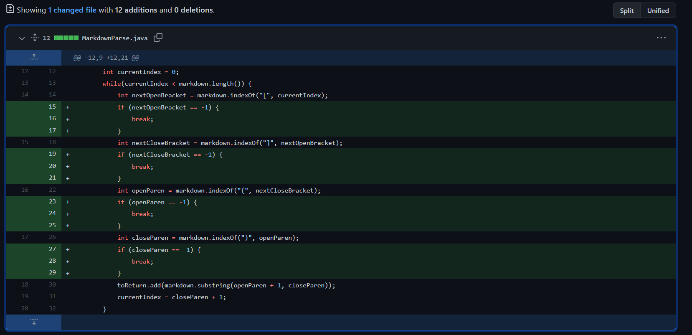
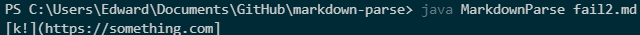
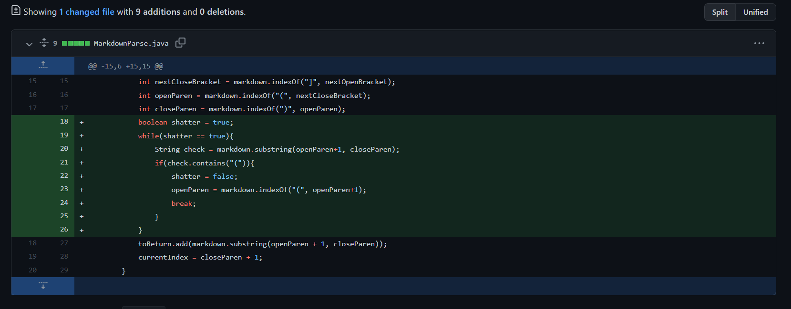
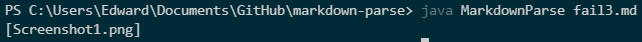
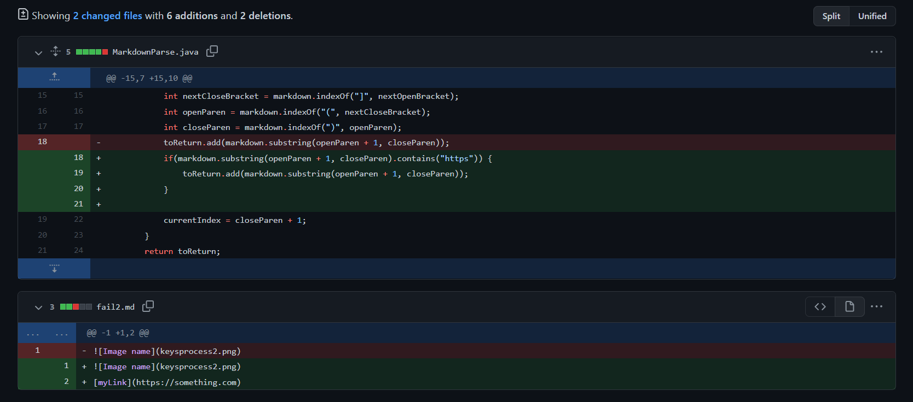

# Lab Report 2

## Fixing Code/Debugging
- In our labs, we had several code changes that were supposed to fix bugs in our programs. Here are 3 examples.

## Issue 1
- The bug was that having many unclosed/open parentheses around each other caused the program to have an infinite loop.

- The symptom was an out of memory error. 

- The failure-inducing input was [this](https://github.com/phrzdgal/markdown-parse/blob/main/newfile.md).

- Because there were so many different pairs of open parentheses that were not closed before the next parentheses began in the failure-inducing input, the program was not able to find the close for the parenthases, and thus started again from a previous position, which was the bug. This caused an infinite loop, and thus an out of memory error, as the system.

- This is how the bug was fixed.

## Issue 2
- The bug was that having an open parentheses that did not contain the link inside it caused the program to misread where the link was.

- The symptom was something after an open parentheses showed up in the output(not a link).

- The failure-inducing input was [this](https://github.com/fantasticfishman/markdown-parse/commit/5c75bdd0f93c274757cfc52fb43b521f0a53cd9c).

- The failure-inducing input that had an open parentheses caused the program to read it as a link, this being the bug, and thus printed it out in the end of the program. The indexes of the different types of parentheses were also messed up. As such, the symptom was an incorrect output with a non-link printed.

- This is how the bug was fixed.

## Issue 3
- The bug was that having an image reference caused the image to be counted as a link instead.

- The symptom was that the name of the image showed up instead of a link. 

- The failure-inducing input was [this](https://github.com/fighterkabir/markdown-parse/commit/0e05f82551ef8c36d66acbe3d82309b472dfdd9d).

- The failure-inducing bug was that there was a image in brackets, which caused the program to treat it as a link(the bug). The symptom caused by this bug was that the file name of the image was printed while nothing should have been printed, or a link if there was one there.

- This is how the bug was fixed.

